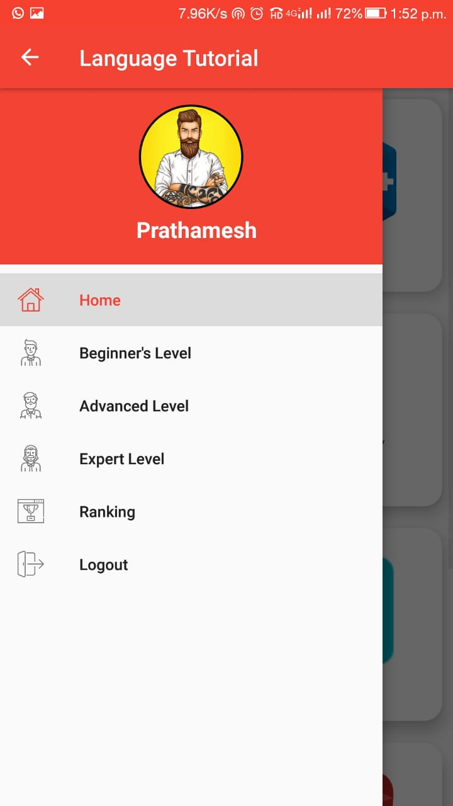
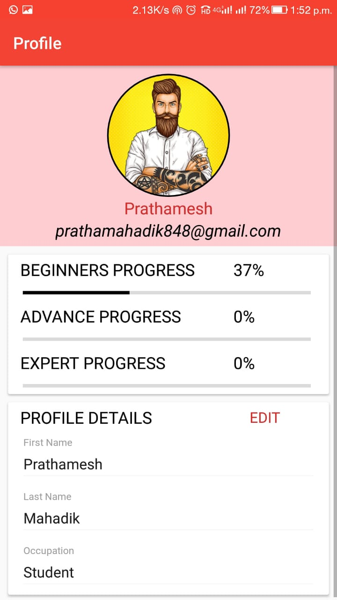
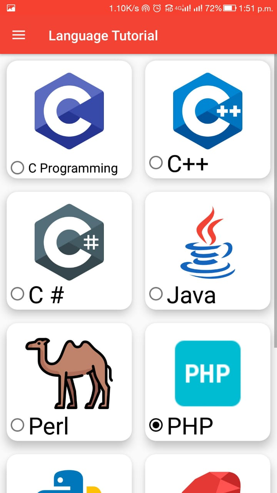
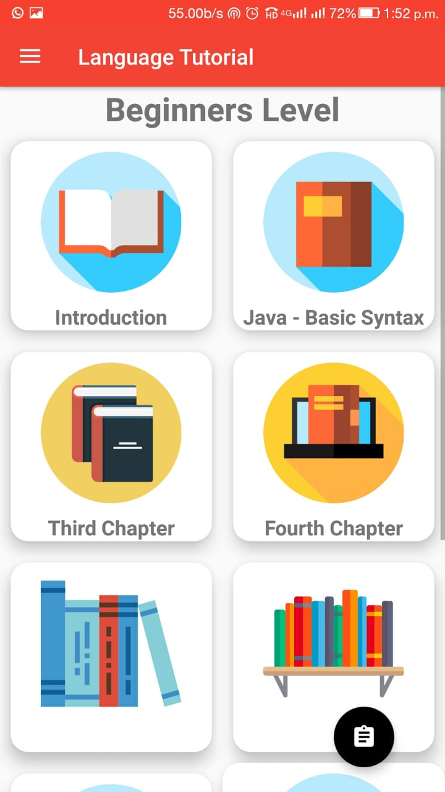

# LanguageTutorial

• This application will give details tutorial and reading content about specific
concept or language using textual or audio/visual material.
 
• User can go through all the modules and submodules for specific concept as
per his/her time convenience (online/offline).
 
• After successful login to application all data relevant will be fetched and
stored locally which will be get updated and sync with live server over the
period of time asynchronously.
 
• Once user is done with reading he/she can go for quiz and relevant tests also
which can be online or offline.
 
 

